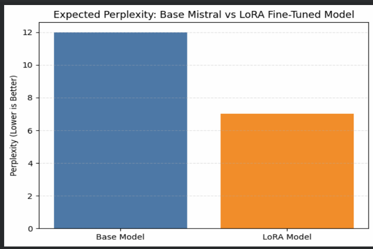
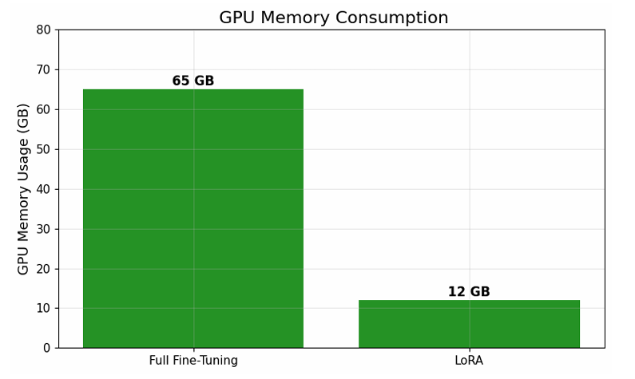

#  MedMind : A LLM, fine-tuned on domain-specific medical data using Mistral-7B


## **Introduction**
This project demonstrates how **PEFT (*Parameter-Efficient Fine-Tuning*)** can reduce **LLM hallucinations** and improve overall **model output quality**. It highlights an **efficient fine-tuning approach** that significantly reduces **GPU memory usage**, **training cost**, and **training time**, while achieving performance comparable to **full fine-tuning**.

---

## **Problem**
1. When using a **public LLM**, the data shared with the model is accessible to the **provider**. Therefore, **privileged data**, such as *medical records* and *company documents*, should not be shared with public LLMs.
2. **Large language models** are good at *general conversations*, but when it comes to **domain-specific knowledge**, they **hallucinate**.
3. **Fine-tuning** is one of the solutions for reducing hallucinations, but it is **very expensive** and requires **intensive hardware**.

---

## **Proposed solution**
1. By using **LoRA**, we fine-tuned only the **adapter modules**, which are approximately **200–300 MB** in size. These adapters can be **easily merged** with the **base model** and **deployed locally**, enabling *efficient and cost-effective model hosting*.
2. By **freezing the base model weights** and fine-tuning only the **LoRA adapter modules** (*Q and V modules*), the model is guided to learn **domain-specific patterns** without altering its **general knowledge**, which helps **reduce hallucinations** and improves **output reliability**.
3. By choosing an appropriate **LoRA rank (*r*)** during fine-tuning, we significantly **minimized computational requirements** and **training costs by approximately 90%**, while maintaining **strong model performance**.

---

## **Problems faced**
1. Finding **high-quality domain-specific data**
2. **Model size** and **deployment challenges**
3. Choosing **optimal LoRA hyperparameters** (*rank, alpha, target modules*)

---

## Specifactions- 
1. Dataset - <a href="https://www.kaggle.com/datasets/pythonafroz/medquad-medical-question-answer-for-ai-research">MedQuAD</a>
2. Model used - <a href="https://huggingface.co/mistralai/Mistral-7B-Instruct-v0.3">Mistral-7B-Instruct-v0.3</a>
3. LoRA Adapter modules - <a href= "https://huggingface.co/Channabasavanna/mistral_medical_lora" >huggingface<>
3. - LoRA adapter config -
     - 
 
4. Cloud GPU - [RunPod](https://www.runpod.io/)

---

## Results - 
1. Reduced perplexity score from 12 to 7 after adding the LoRA adapter modules.
  - 
2. Reduced GPU consumption by 85%
  - 


---

## How to use this-
- Step 01 - Install all the requierements in a suitable venv(python3.10 is better to use)
  - ```python
       !pip install requierements.txt
- Step 02 - Import the required libriaries into the working env 
  -  ```python
        import torch
        from transformers import AutoModelForCausalLM, AutoTokenizer
        from peft import PeftModel
- Step 03 - Load the base model
  - ```python
       base_model_name = "mistralai/Mistral-7B-v0.1"   # replace if needed

       model = AutoModelForCausalLM.from_pretrained(
           base_model_name,
           device_map="auto",
           torch_dtype=torch.float16
       )

       tokenizer = AutoTokenizer.from_pretrained(base_model_name)
       tokenizer.pad_token = tokenizer.eos_token
- Step 04 - Load the adapters and merge with the model
  - ```python
       lora_adapter_path = "Channabasavanna/mistral_medical_lora"  

       model = PeftModel.from_pretrained(
           model,
           lora_adapter_path
       )

    model = model.merge_and_unload()

       

       
       


